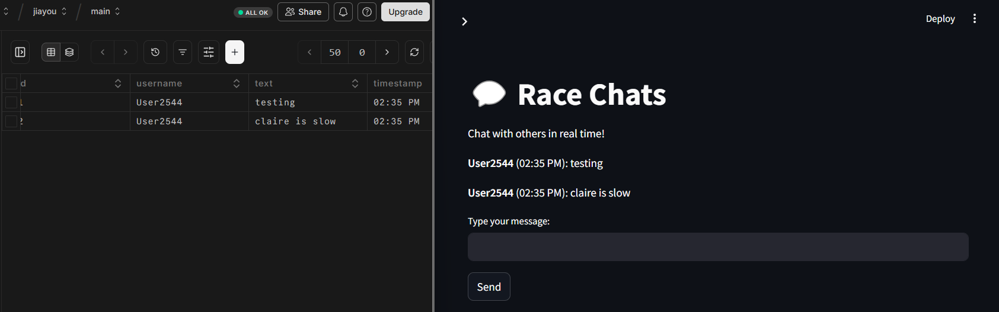

# Jiayou

Cheer me on, whether in person or virtually and asynchronously. "加油" (Jiāyóu), pronounced as "Jyah-yo," translates to "add oil" in Chinese, symbolizing encouragement and support.

Users are likely to be dispersed, and currently, communication via SMS isn’t streamlined or compatible across platforms. In my experience, group chats between Android and Apple users often face issues, such as messages being fragmented and sent out of order. To address this challenge, I’ve created a platform that centralizes information sharing and communication, allowing users to interact with each other anonymously and asynchronously.

Here's an example of anonymous and asynchronous 

